# FLARE-ON 10- Challenge 13

This challenge is a bind shell that opens port 1337. If we use netcat to connect to this port and wireshark to capture packets, we see that it receives windows commands from the client side and returns results. These data are all in unencrypted cleartext form.

This is an obfuscated file so opening it in IDA will not properly parse the functions of this bind shell. To know all the functions of the bind shell, we first need to write a script to convert the obfuscated file into a form that IDA can read.
## 1. Deobfuscating
If we look at the obfuscated code, we notice that the author has obfuscated the program: After each instruction, the jmp instruction is inserted to jump to the next instruction, so the original code will be cut into sentences with discrete command


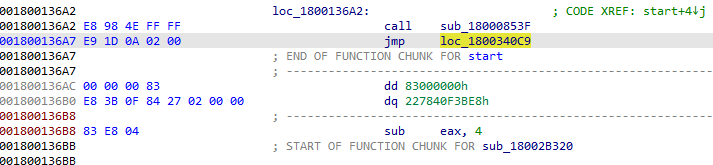

The deobfuscate process needs to put these discrete commands into continuous code and handle relocations such as jump/call commands.
The following algorithm converts the code into a form that IDA can read:

-   We choose each function as a unit to deobfuscate, the first function is the entry point and the StartAddress in CreateThread, the addresses after  call instruction are added to the list of functions

-   For each function, we follow the jmp command to get the opcodes of the instructions. The opcode of the following instruction is stored next to the opcode of the previous instruction, so the code part of a function will be a continuous block, this process will stop when a return command is
encountered

-   For jump instructions (jmp, je/jne, jb/jnb,...), the opcode of the branch instructions is added after the opcode of the main branch above.

-   At each jump and call command position, we need to store the context to serve the relocation process later. This information includes: mnemonic (jump or call), original instruction offset, destination instruction offset. We also recorded the log mapping between the old offset and the new offset of the instruction to facilitate debugging
-   Recursively the above process until all functions in the list are exhausted

To do this we use Capstone – Disassembler Framework and Keystone-Assembler Framework. The implementation code can be found [here](./code/deobfuscate.py)

After running the script in IDA, we get 2 files: [y0da_deobfuscated.bin](./files/y0da_deobfuscated.bin)  and [mapping_address.txt](./files/mapping_address.txt)
## 2.  Bind shell analysis
The original file y0da.exe does not have an import table in the PE file, the import functions are called at runtime by browsing the loaded modules and comparing the function name with the pre-defined hash. The function at 0x180014d24-y0da.exe (equivalent to offset 0xe17 of the file after deobfuscate) is used to get the address or call the import function, argument r15 contains the hash of the function, r14 = 1 indicates whether the import function was called or not, if not it returns the address of the import function.

The flow of the program is as follows:

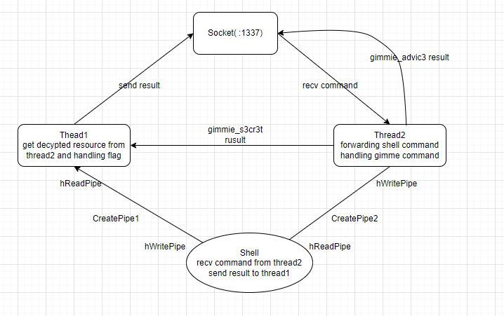

The main function will open a bind shell at port 1337:

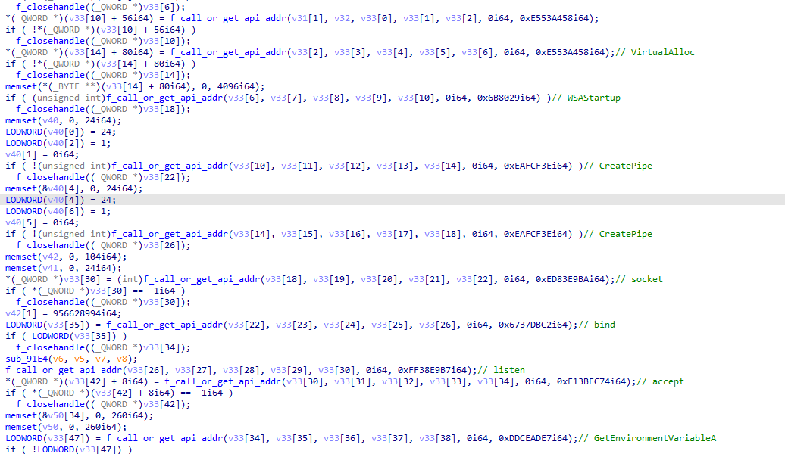

Afterthat, it calls the CreateProcessA function to call cmd.exe with hStdInput as hReadPipe of Pipe2 and hStdOutput as hWritePipe of Pip1. This shell receives commands from Thread 2 via Pipe2 and sends results to Thread1 via Pipe1.

Thread 2 receives commands from the Client via socket, and processes if the incoming command is gimmie_advic3 or gimmie_s3cr3t, otherwise sends the command to cmd.exe via Pipe.
Thread1 and Thread2 both receive input argument that is a global variable containing information::

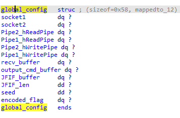

## Thread2

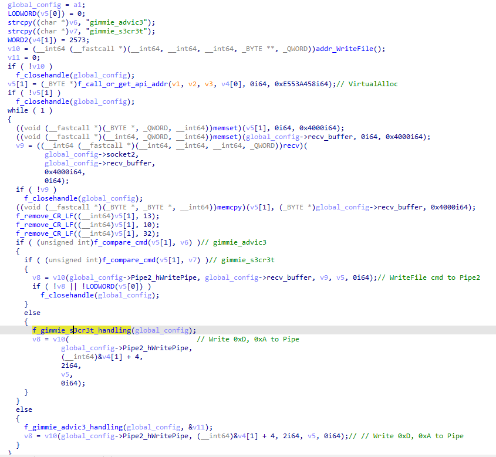

### gimmie_s3cr3t:
gimmie_s3cr3t receives password from user:

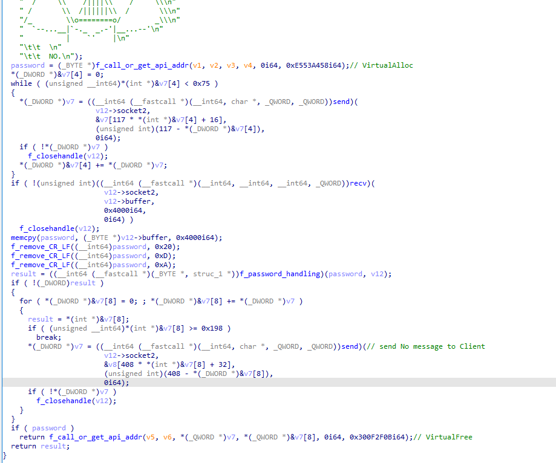

If the password is correct, it will be used to decrypt data from the Resource section, the returned data is a JFIF file:

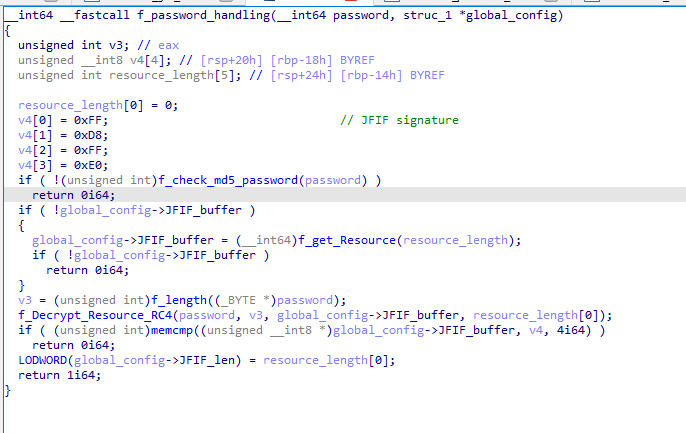

Password check by comparing with hash md5 AA321932CCDD8CCE334A1C3354EED3B1. Cracking this hash on md5 online database gives the password patience_y0u_must_h4v3.

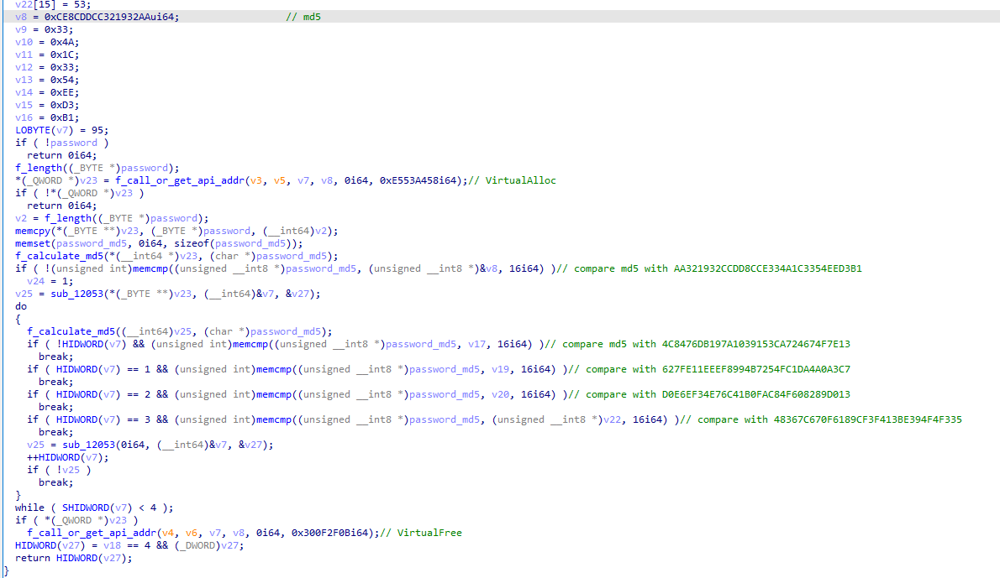

### gimmie_advic3:
Send random messages to the client:

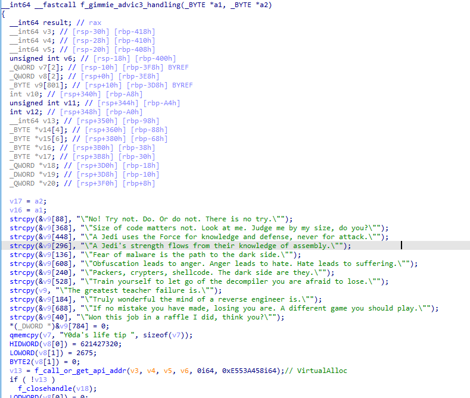

## Thread1:
Thread1 receives output from cmd.exe and returns it to the client. It also checks 4 bytes in JFIF_buffer. If these 4 bytes match the JFIF signature, this proves that the image file has been decoded. The function at offset 0x180050e82 (f_get_flag in the image) processes data hidden in the image file:

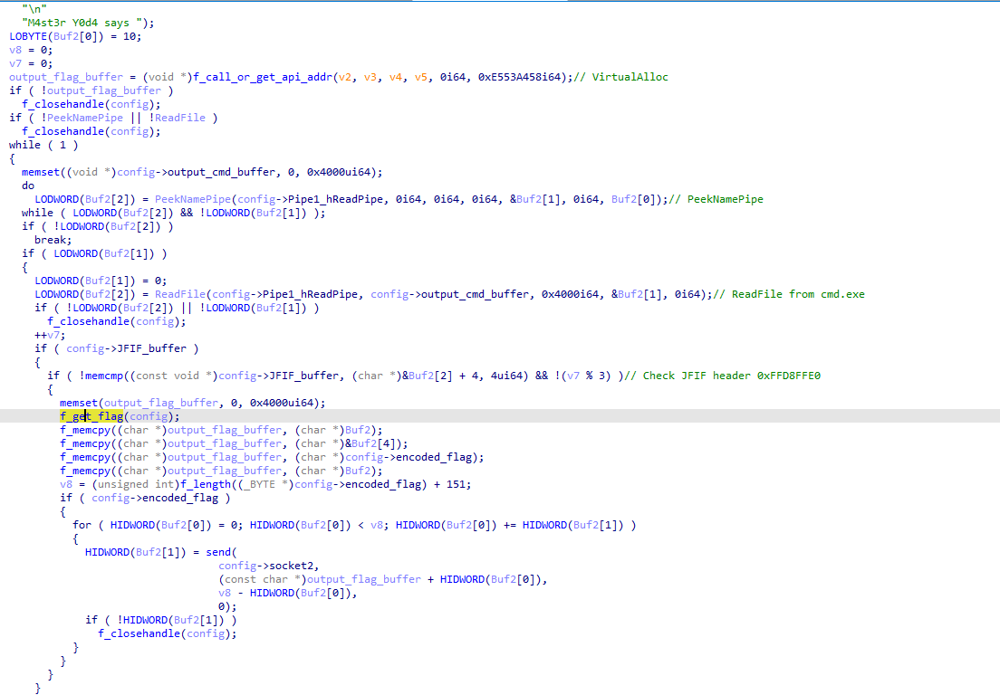

In the f_get_flag function, it extracts block data from the JFIF_buffer file based on signature search. These data blocks include encrypted_flag and ROP chain code:

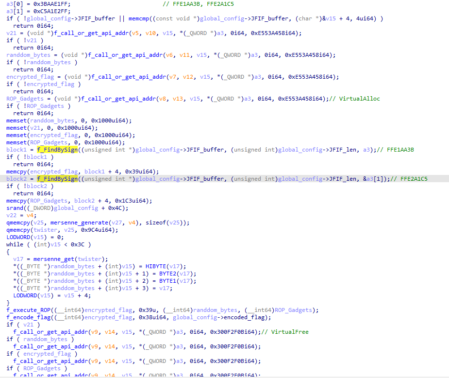

Function f_execute_ROP(encrypted_flag, flag_len, random_bytes, ROP_Gadgets) decrypts flags by executing ROP chain, the input argument includes random bytes generated according to the Mersenne Twister algorithm.
Gadgets are executed in defined order in f_ROP_Chain, addresses are stored in the stack according to the formula:
```asm
mov rsi, r9;
add rsi, gadset_offset
push rsi. 
```
r9 contains the base_address of Gadgets code. By counting the stack pointer in IDA, we see that 0x1140 bytes of stack memory are allocated, equivalent to 552 gadgets.

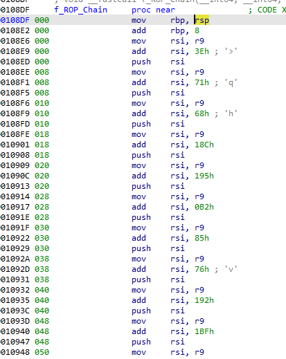

The following code snippet converts 552 gadgets:

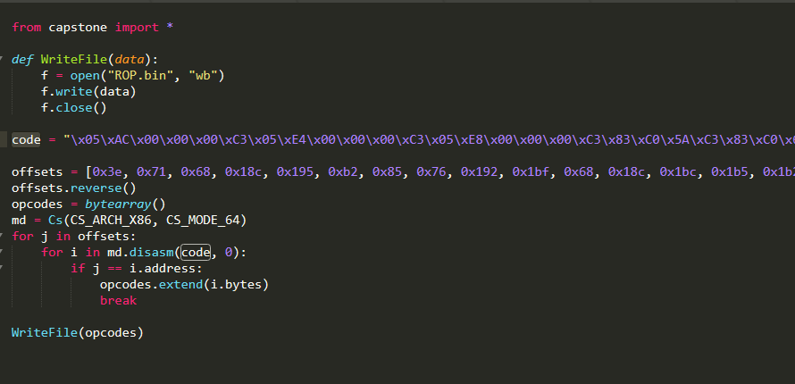

## ROP code:
Of the 552 instructions, the first 520 instructions are to decode the flag, the last 32 instructions are used to xor the flag with randoms bytes:

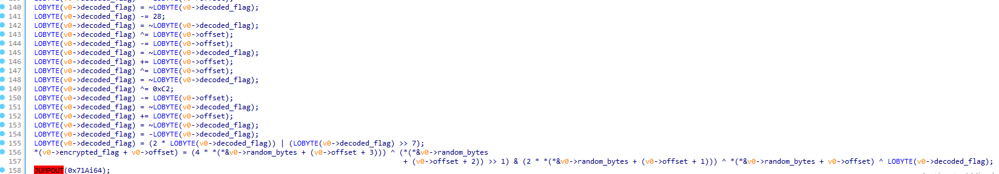

```python
for i in flag_len:
	encrypted_flag[i] = (4*random_bytes[i+3]) ^ (random_bytes[i+2] >> 1) &   (2*random_bytes[i+1]) ^ (random_bytes[i]) ^ (decoded_flag[i])

```
The decoded flag is xored with random bytes and then base64 encoded with custom alphabet and sent rusult to the client.

To obtain flag just set breakpoint at f_execute_ROP, fill random_bytes with 0 and step over this function:

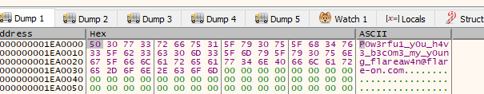


